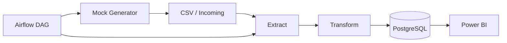

# Tehran Real Estate Pipeline
** still in progress...
**Batch ETL, PostgreSQL data warehouse, and Power BI dashboard** for Tehran residential property listings.

[](https://www.python.org/)
[](https://www.postgresql.org/)
[](https://docs.docker.com/compose/)

> Portfolio project demonstrating production-style data engineering: ingestion, cleaning, containerized storage, orchestration, and analytics-ready views.

---

## Architecture



| Layer | Tool | Purpose |
|-------|------|---------|
| Processing | Python, Pandas | Clean and enrich listings |
| Storage | PostgreSQL 16 | Relational warehouse with upsert |
| Containers | Docker Compose | Reproducible local stack |
| Orchestration | Apache Airflow (optional) | Scheduled ETL + mock ingestion |
| Visualization | Power BI Desktop | Live dashboard from PostgreSQL |

---

## Dataset

Source: Kaggle-style Tehran house listings (`TehranHouse.csv`, ~3,500 rows).

| Column | Description |
|--------|-------------|
| Area | Size in m² |
| Room | Number of rooms |
| Parking, Warehouse, Elevator | Boolean amenities |
| Address | Neighborhood |
| Price | Price in **Rial** |
| Price(USD) | USD equivalent |

**Transform outputs:** `price_toman`, `price_per_sqm`, deduplication hash, optional `build_year` (mock data).

---

## Quick Start

### Prerequisites

- Python 3.12+
- Docker & Docker Compose
- (Optional) Power BI Desktop

### 1. Clone and configure

```bash
git clone <your-repo-url>
cd Tehran_realstate_project
cp .env.example .env
make setup
```

Place `TehranHouse.csv` in `data/raw/` if not already present.

### 2. Start database and run ETL

```bash
make run
# or step by step:
make up
make etl
```

One-liner alternative:

```bash
chmod +x run.sh && ./run.sh
```

### 3. Verify data

```bash
make verify

# Or manually:
docker exec -it tehran_estate_db psql -U tehran_estate -d tehran_real_estate \
  -c "SELECT COUNT(*), AVG(price_per_sqm) FROM listings;"
```

**Expected result:** ~3,239 clean rows loaded from 3,479 raw rows.

> **Docker permission issue?** Add your user to the docker group, then re-login:
> `sudo usermod -aG docker $USER && newgrp docker`

### 4. Power BI

See [dashboard/README.md](dashboard/README.md). Connect to `localhost:5432`, database `tehran_real_estate`, view `vw_listings_analytics`.

---

## Project Structure

```
├── docker-compose.yml      # PostgreSQL + optional Airflow & PgAdmin
├── Makefile                # make run | etl | test | generate
├── run.sh                  # One-command bootstrap
├── src/
│   ├── extract.py          # Read CSV from raw/ and incoming/
│   ├── transform.py        # Clean, convert Rial→Toman, dedupe
│   ├── load.py             # Upsert into PostgreSQL
│   ├── etl_pipeline.py     # Full pipeline CLI
│   └── data_generator.py   # Mock daily listings
├── dags/real_estate_dag.py # Airflow: generate → ETL
├── notebooks/exploration.ipynb  # EDA notebook
├── scripts/verify_pipeline.py   # End-to-end verification
├── .github/workflows/ci.yml     # GitHub Actions CI
├── cron/crontab.example    # Cron automation template
├── sql/init.sql            # Schema + analytics view
├── tests/                  # pytest unit + integration tests
└── dashboard/              # Power BI assets (build locally)
```

---

## Extensibility

`extract.py` reads from:

- `data/raw/` — baseline dataset
- `data/incoming/` — new files (mock generator, future API exports)

Swap `extract.py` for an API client or scraper without changing transform/load.

```bash
make generate   # 50 mock rows → data/incoming/
make mock-etl   # generate + full pipeline
```

---

## Airflow (optional)

```bash
make up-all
# UI: http://localhost:8080  (admin / admin)
# Enable DAG: tehran_real_estate_etl
```

DAG flow: **generate_mock_data** → **run_etl_pipeline** (daily schedule).

---

## Cron automation (simple alternative)

See [cron/crontab.example](cron/crontab.example) or:

```cron
0 6 * * * cd /path/to/Tehran_realstate_project && ./run.sh >> logs/etl.log 2>&1
```

---

## Data Quality Handling

| Issue | Solution |
|-------|----------|
| Price swapped into Area column | Auto-detect and swap |
| Missing addresses (23 rows) | Dropped |
| Extreme price/m² outliers | Filtered (1M–500M Rial/m²) |
| Duplicate listings | SHA-256 hash + `ON CONFLICT` upsert |

---

## Tests & CI

```bash
make test          # unit tests (8 tests)
pytest -m integration  # full DB test (requires PostgreSQL running)
```

GitHub Actions runs unit tests + full ETL integration against PostgreSQL on every push.

---

## Project Status

| Component | Status |
|-----------|--------|
| ETL pipeline | Done |
| PostgreSQL schema + upsert | Done |
| Docker Compose stack | Done |
| Airflow DAG | Done |
| Mock data generator | Done |
| Unit tests | Done (8 passing) |
| EDA notebook | Done |
| GitHub Actions CI | Done |
| Power BI dashboard | **You build this** — see [dashboard/README.md](dashboard/README.md) |

---

## Future Improvements

- [ ] Power BI dashboard + screenshot in README
- [ ] dbt models for staging/marts layers
- [ ] Live API or scraping source in `extract.py`
- [ ] Great Expectations data contracts
- [x] CI pipeline (GitHub Actions: pytest + PostgreSQL)
- [ ] Geocoding neighborhoods for map visuals

---

## License

MIT — see [LICENSE](LICENSE).
